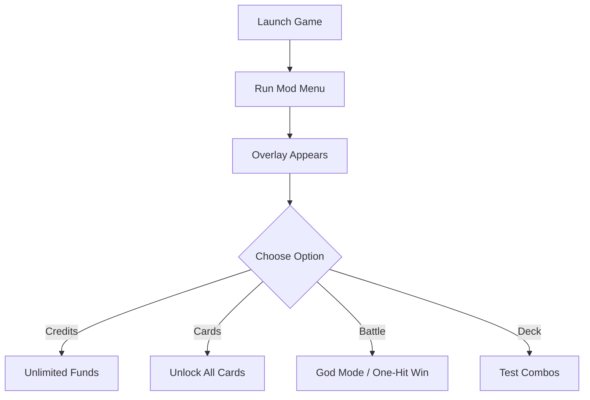

# 🪖 KARDS – The WWII Card Game Mod Menu

KARDS blends strategic deck-building with WWII tactics, where resource management and card unlocks shape your victories. But the grind for credits and rare cards can take hours before you get to the fun part. The **KARDS Mod Menu** changes this—giving you a powerful in-game overlay to control cards, credits, and battle settings instantly.

This isn’t just about shortcuts—it’s about creating the freedom to build any deck, try new strategies, and experience the full game without barriers.

---

## 👁 Overview

With the mod menu enabled, you can:

* Unlock all cards instantly for creative deck-building
* Inject unlimited credits for fast purchases
* Toggle battle assists like god mode or one-hit wins
* Adjust match pacing by skipping animations
* Experiment with combos and factions without grind

It’s perfect for players who want to **explore strategies** or enjoy a **sandbox deck-building experience**.

---

## ⚙️ Mod Menu Features

* **💰 Unlimited Credits** – Buy packs and upgrades without limits.
* **🃏 Instant Card Unlocks** – Access all cards across factions.
* **⚡ Fast Battle Mode** – Speed up animations and match flow.
* **🛡 Invulnerability Option** – Protect HQ from defeat.
* **🎯 One-Hit KO Toggle** – End routine matches instantly.
* **🎛 Overlay Hotkeys** – Fully customizable for smooth control.

[!WARNING]
The **KARDS Mod Menu** is designed for **offline play and testing only**. Use it to explore, not to interfere with online ranked systems.

---

## 🖥 Compatibility

| Platform        | Status | Notes                        |
| --------------- | ------ | ---------------------------- |
| Windows 10/11   | ✅      | Fully supported              |
| Steam Edition   | ✅      | Recommended                  |
| Other Launchers | ⚠️     | Manual setup may be required |
| Mac/Linux       | ❌      | Not supported                |

---

## ⚡ Setup Instructions

1. Download the Mod Menu package.
2. Launch **KARDS – The WWII Card Game**.
3. Run `kards_modmenu.exe` as Administrator.
4. Press `F9` in-game to open the overlay.
5. Use toggles and sliders to activate features.

```bash
# Quick launch example
kards_modmenu.exe --overlay --credits --unlock
```

---

## 📊 Mod Menu Flow



---

## ❓ FAQ

**Q: Does this unlock all premium and rare cards?**
A: Yes, the menu can unlock every card instantly.

**Q: Is it safe for campaign saves?**
A: Yes, changes are reversible and do not corrupt progress.

**Q: Will this work online?**
A: No, it’s designed only for offline and sandbox use.

**Q: Can I remap hotkeys?**
A: Yes, every option can be rebound to your preference.

---

## 🚀 Final Thoughts

The **KARDS Mod Menu** removes grind and gives you total freedom to explore WWII deck-building like never before. Whether you want to simulate top-tier decks, test creative strategies, or simply enjoy battles without restrictions—this menu unlocks the full experience.

---
